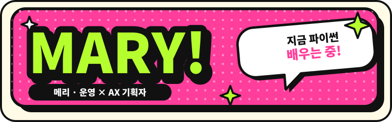
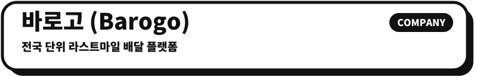
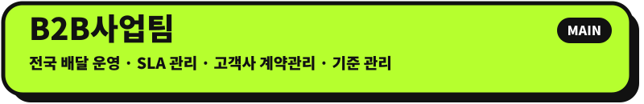
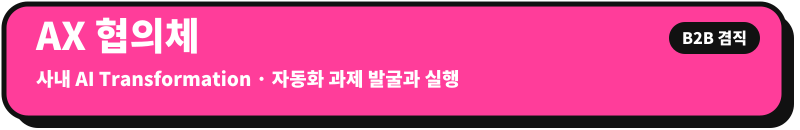
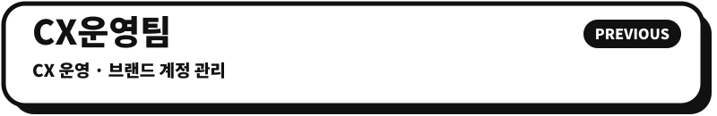
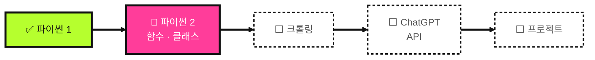

<br><br>





<br><br><br>

## 
```현장향``` ```운영``` ```기획자``` ```반복업무``` ```자동화```<br>
``` AX ``` ```CX운영``` `Account Manager`
```2륜배송``` `여성의류쇼핑몰` 
| 항목 | 내용 |
|---|---|
| **이름** | 김혜리 |
| **MBTI* | ESFP |
| **Blood Type** | O형 |
| **사는 곳** | 서울 |
| **음식 취향** | 맵고수는 아니지만 **매운맛 좋아해**🌶<Br>짠 음식은 잘 못 먹어용 |

<br><br>

## 

**재직 기간** `[입사 연월]` ~ 2026.08 <!-- TODO: 입사 연월 -->

<br>


`[연월]` ~ 2026.08
- 대형 리테일·프랜차이즈 등 **다수 브랜드 고객사**의 배달 성과(SLA) 모니터링 및 개선 전략 수립
- 주간·월간 성과 리포트를 **고객사·허브·경영진 눈높이에 맞춰** 설계 (두괄식, 표·도식 우선)
- 신규 브랜드 대상 **역제안(선제 제안) 파이프라인** 운영 — 제안 현황 보드와 팀 공유 포맷 정비
- 라이더 인센티브·지원금 정책 설계 (청구/비청구 비용 구조 구분)
- 고객사와의 **SLA 미팅 → 미팅록 → 후속 조치**까지 관리

<br>


`[연월]` ~ 2026.08 
- 손으로 하던 리포팅을 **AI 에이전트·자동화 파이프라인**으로 전환하는 과제 기획
- 팀 단위 **Claude 활용 체계**(프로젝트 구성, 작성 스타일 가이드) 설계

<br>


`[연월]` ~ `[연월]`
- `[담당했던 일]`

<br><br>


## 
> 회사 자료 **익명화** & 내부 수치 미적재<br>

### 🤖 자동화 · AI (5)
| 프로젝트 | 무엇을 | 사용 도구 |
|---|---|---|
| **B2B 운영 CRM 프로토타입** | 브랜드별 SLA·계약·수행 등의 데이터를 한 눈에 보는 부서 CRM 페이지를 설계/제작/관리 | Claude Code(바이브 코딩) · Ollama |
| **팀 지표 자동 수집 파이프라인** | Redash API·구글시트에서 데이터를 모아 엑셀 리포트 생성. 매월 반복하던 수작업 제거 | Python · pandas · openpyxl · Streamlit |
| **브랜드별 SLA 일일 리포트 자동화** | 브랜드 전담 'AI 직원'이 평일 아침 SLA 리포트를 슬랙으로 자동 발송. 전체 합계 + 지역별 WORST 5 구조로 핵심만 요약 | Redash · Slack · AI BI · n8n |
| **외부 메일 모니터링 에이전트** | 팀 메일함에서 브랜드 외부 메일만 골라 To-Do·공유 CSV로 자동 기록 | AX 플랫폼 · SharePoint · MS To-Do |
| **Claude Cowork 프로젝트 체계** | 업무 영역별 9개 프로젝트와 공통 지침(CLAUDE.md) 세트 설계 | Claude Cowork |

<br>


### 📊 데이터 분석(4)
| 프로젝트 | 무엇을 | 사용 도구 |
|---|---|---|
| **대형 뷰티 리테일 브랜드 주간 성과 분석** | 주간 SLA·손익·보상 지표 비교, 날씨·라이더 공급 등 복합 요인 진단, 인터랙티브 대시보드 | Excel · Chart.js · Redash |
| **지역 SLA 저하 원인 분석** | 인접 3개 점포의 동시 저하 구간을 찾아 최우선 점포 도출 | SQL · 대시보드 |
| **대형 IP 콜라보 이벤트 물동량 예측** | 오픈·성수기·종료 3단계 시나리오 및 지사·CX 운영 가이드 배포 | 시나리오 분석 · Slack |
| **배달 주소 지오코딩 · 기상 데이터 수집** | 주소→좌표 변환, 기상청 API 자동 수집 파이프라인 | Python · Google Maps API · 기상청 API |

<br>

### 🧩 기획 · 전략(4)
| 프로젝트 | 무엇을 | 사용 도구 |
|---|---|---|
| **대형 유통 브랜드 주간 리포트 체계** | Notion + PPT + 엑셀 3시트(요약·Raw·지원금)로 구성한 표준 리포트 | Excel · Notion · PPT |
| **로봇배달·라이더 릴레이 PoC 입지 분석** | 서울 대단지 아파트(5천 세대급) 반경 상점 매핑 → 수요 분석 → PoC 우선 브랜드 랭킹 | QGIS · 공공데이터 · Notion |
| **CX 매뉴얼 갭 분석** | 응대 매뉴얼의 기준 불일치·누락(지연 기준, 증빙, 에스컬레이션)을 도출하고 귀책·보상 플로우차트로 시각화 | Notion · SVG |
| **크라우드소싱 배달 플랫폼 기획** | 구조 초기 설계·기획 참여 | 기획 |

<br>

### 🌱 학습 기록 (4)
| 저장소 | 내용 |
|---|---|
| [`AI-Study`] | AI 부트캠프 개념 정리 + 실습 코드 (배포예정) |
| [`Codeup 저장소`](https://github.com/doxoba/01_python_basic_100.git) | 코드업 파이썬 기초 100제 |
| [`Programmers 저장소`](https://github.com/doxoba/02_programmers) | 프로그래머스 기초 문제 |
| [`SQL Day5 과제 저장소`](https://github.com/doxoba/assignment) | MySQL 5일차 과제 30제 |

<br>

## 

> *HYUNDAI AI 서비스 기획 부트캠프 수강중 `[~27' 04]` 



**🙌 현재까지의 진도: SQL - JOIN**

<br>

### 📋 커리큘럼 · 과제 자세히 보기
#### [커리큘럼]
| 단계 | 주제 | 상태 |
|---|---|---|
| 1 | 파이썬과 프로그래밍 1 | ✅ |
| 2 | 파이썬과 프로그래밍 2 — 함수 · 예외처리 · 모듈 · 클래스 | 🔄 |
| 3 | 크롤링 · 웹 기초 | ⬜ |
| 4 | 크롤링 패턴 · 활용 | ⬜ |
| 5 | ChatGPT API 사용법 | ⬜ |
| 6 | API 활용 Workshop | ⬜ |
| 이후 | 프롬프트 엔지니어링 · RAG · 멀티모달 · 백엔드/프론트엔드 · 배포 · MCP | ⬜ |
| 최종 | 프로젝트 (4개 마일스톤) | ⬜ |
#### [과제]
| 기간 | 과제 | 상태 |
|---|---|---|
| 08.31 ~ 09.06 | 기초과제 · Codeup 파이썬 기초 100제 | 완료^^ |
| 09.07 ~  | 기본과제 · 프로그래머스 코딩 기초 트레이닝 124문제 | 진행중ㅠ |
| 09.19 ~ 21 | 기본과제 · SQL JOIN 관련 30제 | 완료^^ |

- 개념 정리와 실습 코드는 GitHub에 매일 기록하려고 노력중
- 문제 1개 풀면 1커밋 — 매일 잔디 기르기 
- SQLD(11월 중순 시험) → COS Pro 1급 Python 순서로 자격증 도전 예정 ><~

## 
데이터 기반 의사결정을 좋아하는 **현장형** 🔥
| 키워드 | 이렇게 일해요 |
|---|---|
| 현장 우선 | 숫자를 보기 전에 **현장에서 무슨 일이 벌어지는지**부터 이해해요 |
| 데이터로 결론 | 감이 아니라 **지표와 근거**로 판단하고, 확인되지 않은 건 '추정'이라고 표시해요 |
| 두괄식 · 도식 | 결론부터, 표와 도식으로 정리해서 **읽는 사람의 시간을 아껴요** |
| AI는 파트너 | 일을 떠넘기는 도구가 아니라 **시스템을 직접 설계하는 도구**로 써요 |
| 질문하고 시작 | 바로 만들기보다 **먼저 묻고 맥락을 맞춘 뒤** 시작해요 |
| 비유로 배우기 | 새로운 개념은 **생활 속 비유**(장바구니·우편함)로 붙잡고, 반복으로 몸에 익혀요 |

## 

- e-mail: `[01.06@hanmail.net]`